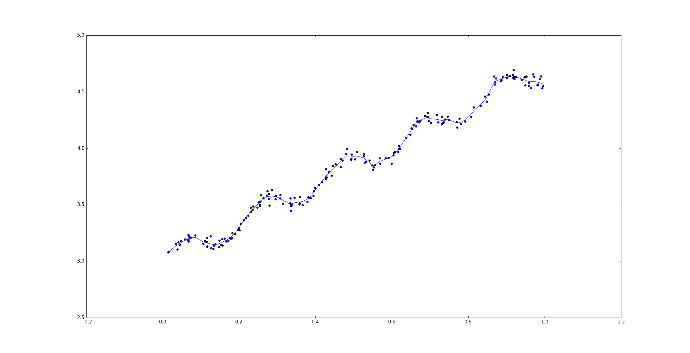

### 1. [概率统计中常见概念总结](./math_notes/README.md)

* 总体均值、总体方差

* 样本均值、样本方差

* 无偏估计、有偏估计

* 样本标准差

* 样本协方差、协方差矩阵

### 2. 一些常用的机器学习算法实现

#### 算法包括：

* Apriori 算法

* DesicionTree 算法

* HMM模型 Viterbi 算法

* 针对文本分类的 NaiveBayes 算法

* 针对文本分类的 LogisticRegression 算法

* 回归算法：

	* 标准的线性回归
	
	* 局部加权线性回归
	
	* 岭回归

#### 结果示例：

### 3. 一些常用的机器学习框架

#### 框架包括：

* [Keras](./ml_notes/Keras/%E6%B7%B1%E5%BA%A6%E5%AD%A6%E4%B9%A0%E4%B9%8BKeras%E5%85%A5%E9%97%A8.md)

* [TensorFlow](./ml_notes/TensorFlow/%E6%B7%B1%E5%BA%A6%E5%AD%A6%E4%B9%A0%E4%B9%8BTensorFlow%E5%85%A5%E9%97%A8.md)

* [sklearn](./ml_notes/sklearn/sklearn%E4%BD%BF%E7%94%A8%E6%80%BB%E7%BB%93.md)