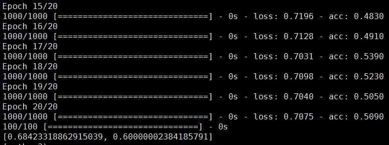

**Keras**是一个上层的神经网络API，它由纯Python编写而成并基Tensorflow、CNTK或者Theano为后端，其项目地址位于 https://github.com/fchollet/keras 。

Keras的核心数据结构是**"模型"**，这是一种组织网络层的方式。最简单的模型是**Sequential**模型，这是一系列网络层按顺序构成的栈。

## Keras环境搭建

#### Keras依赖下面几个库：
	
	numpy, scipy
	yaml
	HDF5 and h5py (Optional)
	cuDNN (Optional)

#### 具体搭建步骤：

* 安装开发包
	

	sudo apt install -y python-dev python-pip python-nose gcc g++ git gfortran vim

* 安装运算加速库

	
	sudo apt install -y libopenblas-dev liblapack-dev libatlas-base-dev

* 安装keras

	
	pip install keras

* 安装tensorflow(使用TensorFlow为后端)

	
	pip install tensorflow # for Python 2.7
	pip install tensorflow-gpu # for Python 2.7 and GPU
	
* keras中mnist数据集测试

	
	git clone https://github.com/fchollet/keras.git
	cd keras/examples/
	python mnist_mlp.py

## Keras上层API使用

#### 搭建模型

搭建一个Sequential模型：

	from keras.models import Sequential
	from keras.layers import Dense, Activation

可以通过向Sequential模型传递一个layer的list来构造该模型：

	model = Sequential([
	    Dense(units=64, input_shape=(100,)),
	    Activation('relu'),
	    Dense(units=10),
	    Activation('softmax'),
	])

也可以通过.add()方法一个个的将layer加入Sequential模型中：
	
	model = Sequential()
	model.add(Dense(units=64, input_dim=100))
	model.add(Activation('relu'))
	model.add(Dense(units=10))
	model.add(Activation('softmax'))

#### 编译模型

这一步用来配置模型的学习流程，编译模型时必须指明**损失函数、优化器、度量**：

	model.compile(loss='categorical_crossentropy', optimizer='sgd', metrics=['accuracy'])

* 损失函数

	该参数为模型试图最小化的目标函数，它可为预定义的损失函数名，如categorical_crossentropy、mse，也可以为一个损失函数。

* 优化器

	该参数可指定为已预定义的优化器名，如rmsprop、adagrad，或者为一个Optimizer类的对象。

* 度量

	
	对分类问题，一般将该列表设置为metrics=['accuracy']。指标可以是一个预定义指标的名字，也可以是一个用户定制的函数。

如果你需要的话，你可以自己定制损失函数：

	from keras.optimizers import SGD
	model.compile(loss='categorical_crossentropy', optimizer=SGD(lr=0.01, momentum=0.9, nesterov=True))

#### 训练模型

我们在训练数据上按batch进行一定次数的迭代来训练网络：

	model.fit(x_train, y_train, epochs=5, batch_size=32)

我们也可以手动将一个个batch的数据送入网络中训练：

	model.train_on_batch(x_batch, y_batch)

#### 评估模型

	loss_and_metrics = model.evaluate(x_test, y_test, batch_size=128)

#### 模型预测

	classes = model.predict(x_test, batch_size=128)

## Keras代码举例

以**"基于多层感知器(Multilayer Perceptron, MLP)的sigmoid二分类"**为例，代码如下：

	import keras
	from keras.models import Sequential
	from keras.layers import Dense, Dropout, Activation
	
	# Generate dummy data, with 2 classes (binary classification)
	import numpy as np
	x_train = np.random.random((1000, 20))
	y_train = np.random.randint(2, size=(1000, 1))
	x_test = np.random.random((100, 20))
	y_test = np.random.randint(2, size=(100, 1))
	
	model = Sequential()
	model.add(Dense(64, activation='relu', input_dim=20))
	model.add(Dropout(0.5))
	model.add(Dense(64, activation='relu'))
	model.add(Dropout(0.5))
	model.add(Dense(1, activation='sigmoid'))
	
	model.compile(loss='binary_crossentropy',
	              optimizer='sgd',
	              metrics=['accuracy'])
	
	# Train the model, iterating on the data in batches of 128 samples
	model.fit(x_train, y_train,
	          epochs=20,
	          batch_size=128)
	
	score = model.evaluate(x_test, y_test, batch_size=128)
	print(score)

#### 运行结果

