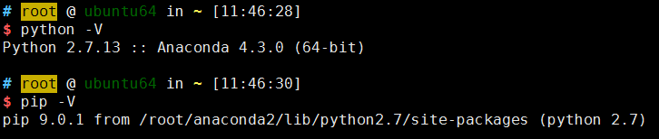
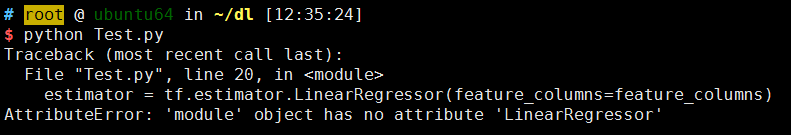
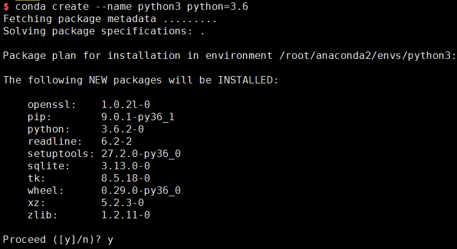
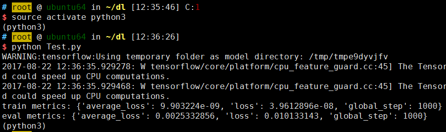

TensorFlow支持Ubuntu、Mac OS X、Windows，也支持从源码安装。本文以**Ubuntu**操作系统为例，来讲解TensorFlow的环境搭建过程。

### TensorFlow分为两个版本：

* CPU支持版本

	如果系统没有安装GPU，那么只能使用TensorFlow的CPU支持版本。
	
* GPU支持版本

	如果系统安装了GPU，并且添加了其他相关支持(安装CUDA Toolkit、cuDNN、libcupti-dev库等)，则可以使用TensorFlow的GPU支持版本。

### TensorFlow可以从以下方式安装：

* virtualenv安装

* 原生的pip安装

* Docker安装

* Anaconda安装

* 从源码安装

### 在Ubuntu上安装TensorFlow

首先，查看系统版本：

	$ cat /etc/lsb-release 
	DISTRIB_ID=Ubuntu
	DISTRIB_RELEASE=14.04
	DISTRIB_CODENAME=trusty
	DISTRIB_DESCRIPTION="Ubuntu 14.04.5 LTS"

由于没有安装GPU支持，因此只能在Ubuntu系统上安装TensorFlow的CPU支持版本。

其次，查看python和pip：

这里，采用Anaconda中的pip来安装，对应python2版本：

	pip install tensorflow

安装完毕，我们可以使用python交互式终端运行下面代码：

	>>> import tensorflow as tf
	>>> sess = tf.Session()
	>>> hello = tf.constant('hello world!')
	>>> print(sess.run(hello))
	hello world!

### Python2与Python3的版本切换

我们来测试TensorFlow官方的一段代码：

	import numpy as np
	import tensorflow as tf
	
	'''
	tf.estimator
	'''
	
	x_train = np.array([1., 2., 3., 4.])
	y_train = np.array([0., -1., -2., -3.])
	x_eval = np.array([2., 5., 8., 1.])
	y_eval = np.array([-1.01, -4.1, -7, 0.])
	input_fn = tf.estimator.inputs.numpy_input_fn(
	    {"x": x_train}, y_train, batch_size=4, num_epochs=None, shuffle=True)
	train_input_fn = tf.estimator.inputs.numpy_input_fn(
	    {"x": x_train}, y_train, batch_size=4, num_epochs=1000, shuffle=False)
	eval_input_fn = tf.estimator.inputs.numpy_input_fn(
	    {"x": x_eval}, y_eval, batch_size=4, num_epochs=1000, shuffle=False)
	
	feature_columns = [tf.feature_column.numeric_column("x", shape=[1])]
	estimator = tf.estimator.LinearRegressor(feature_columns=feature_columns)
	
	estimator.train(input_fn=input_fn, steps=1000)
	
	train_metrics = estimator.evaluate(input_fn=train_input_fn)
	eval_metrics = estimator.evaluate(input_fn=eval_input_fn)
	print("train metrics: %r"% train_metrics)
	print("eval metrics: %r"% eval_metrics)

将测试代码写进Test.py脚本，在python2环境下，运行结果如下：

#### 程序会报错，指出来tf.estimator模块下不存在LinearRegressor属性。

为什么会出现这个问题呢？我想可能是Python2下的tensorflow库中一些上层接口功能没有跟进，而且考虑到Python2版本到2020年会停止支持，因此Google官方可能对Python3下的tensorflow库支持会更全面一些。既然这样，从Python2环境切换到Python3环境，是一个避免这些问题的办法。

与Virualenv类似，Anaconda支持搭建Python的虚拟环境，也就是说，无论Anaconda是基于Python2版本还是Python3版本，我们都可以搭建Python的双版本共存环境，根据项目需要，随时可以切换版本。

#### 搭建Python3环境：

#### 激活python3环境，并运行Test.py：

运行成功！