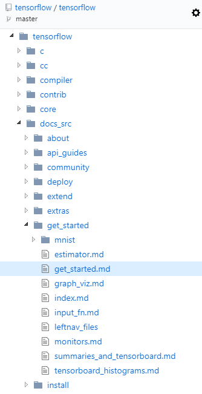

**TensorFlow**是Google维护的一个基于数据流图的可扩展的机器学习框架，其项目地址位于 https://github.com/tensorflow/tensorflow ，我们可以从项目中找到官方的文档说明。

TensorFlow提供了多层的API接口。**"TensorFlow Core"**为其最底层API接口，通过它，我们能够对开发流程进行更全面的把控，而上层的API接口都是基于"TensorFlow Core"进行封装的，这样我们能对"TensorFlow Core"更快上手和使用，从而使复杂流程变得简单高效。

## 什么是"Tensor"

在TensorFlow中，数据的基本单位是**Tensor**，中文名叫**"张量"**，每个Tensor是由一个**多维数组**构成的，而Tensor的阶数，就是数据的维度。在Python语言中, 返回的Tensor是numpy ndarray对象。

比如说：

	3 # 0阶Tensor，大小为[]
	[1., 2., 3.] # 1阶Tensor，大小为[3]
	[[1., 2., 3.], [4., 5., 6.]] # 2阶Tensor，大小为[2, 3]
	[[[1., 2., 3.]], [[7., 8., 9.]]] # 3阶Tensor，大小为[2, 1, 3]

## 从"TensorFlow Core"入手

在TensorFlow中一系列操作可以由**"计算图"**表示，也就是一系列节点构成的图。程序通常被组织成一个构建阶段和一个执行阶段，在**构建阶段**，操作的执行步骤被描述成一个图，而在**执行阶段**, 使用会话执行执行图中的操作。

在图中，每个节点可以输入0或个多个Tensor，输出1个Tensor。

#### 导入tensorflow
	
	import tensorflow as tf

#### Session会话

首先，创建一个session会话，我们必须在**会话**中执行图：
	
	# session
	sess = tf.Session()

#### Constant常量与Variable变量

Constant和Variable是Tensor节点的两种类型，对应数据的常量与变量的赋值。对于变量来说，需要在会话中进行初始化才能真正赋值：

	# One type of the Tensor nodes is Constant
	node1 = tf.constant(3.0, dtype=tf.float32)
	node2 = tf.constant(4.0) # also tf.float32 implicitly
	print(sess.run([node1, node2])) # [3.0, 4.0]
	# One type of the Tensor nodes is Variable
	W = tf.Variable([.3], dtype=tf.float32)
	b = tf.Variable([-.3], dtype=tf.float32)
	init = tf.global_variables_initializer()
	sess.run(init)
	print(sess.run([W, b])) 
	# [array([ 0.30000001], dtype=float32), array([-0.30000001], dtype=float32)]

#### placeholder占位符

placeholder表示声明一个数据变量，而后可以定义对它的操作。在后面执行图的过程中，我们可以通过**字典**传参的方式将占位符赋值。
	
	# placeholder
	# A placeholder is a promise to provide a value later.
	a = tf.placeholder(tf.float32)
	b = tf.placeholder(tf.float32)
	adder_node = a + b  # + provides a shortcut for tf.add(a, b)
	print(sess.run(adder_node, {a: 3, b: 4.5})) # 7.5
	print(sess.run(adder_node, {a: [1, 3], b: [2, 4]})) # [ 3.  7.]
	add_and_triple = adder_node * 3.
	print(sess.run(add_and_triple, {a: 3, b: 4.5})) # 22.5

#### 创建模型

我们可以定义一个模型，比如说线性模型，通过指定自变量的值，输出其对应的计算结果。

	linear_model = W*x + b
	print(sess.run(linear_model, {x: [1, 2, 3, 4]}))
	# [ 0.          0.30000001  0.60000002  0.90000004]

#### 评估模型

我们还可以定义一个损失函数，比如采用误差平方和(SSE)来定义损失函数，通过损失函数计算结果来判断模型的好坏。

	# produce the loss value
	y = tf.placeholder(tf.float32)
	squared_deltas = tf.square(linear_model - y)
	loss = tf.reduce_sum(squared_deltas)
	print(sess.run(loss, {x: [1, 2, 3, 4], y: [0, -1, -2, -3]})) # 23.66

#### 训练模型

TensorFlow中定义了一系列优化器，比如采用梯度下降法(Gradient Descent)来寻找损失函数最小的模型参数。

	optimizer = tf.train.GradientDescentOptimizer(0.01)
	train = optimizer.minimize(loss)

	sess.run(init) # reset values to incorrect defaults.
	print(sess.run([W, b])) 
	# [array([ 0.30000001], dtype=float32), array([-0.30000001], dtype=float32)]
	for i in range(1000):
	  sess.run(train, {x: [1, 2, 3, 4], y: [0, -1, -2, -3]})
	
	# produce the final model parameters
	print(sess.run([W, b])) 
	# [array([-0.9999969], dtype=float32), array([ 0.99999082], dtype=float32)]

#### TensorBoard 

整个机器学习的流程，可以通过TensorBoard可视化为下图表示。

## 使用上层封装API

上层封装的API能够大大简化机器学习流程，这里，我们使用**"tf.estimator"**来做程序示例。

#### 数据定义
	
	x_train = np.array([1., 2., 3., 4.])
	y_train = np.array([0., -1., -2., -3.])
	x_eval = np.array([2., 5., 8., 1.])
	y_eval = np.array([-1.01, -4.1, -7, 0.])
	input_fn = tf.estimator.inputs.numpy_input_fn(
	    {"x": x_train}, y_train, batch_size=4, num_epochs=None, shuffle=True)
	train_input_fn = tf.estimator.inputs.numpy_input_fn(
	    {"x": x_train}, y_train, batch_size=4, num_epochs=1000, shuffle=False)
	eval_input_fn = tf.estimator.inputs.numpy_input_fn(
	    {"x": x_eval}, y_eval, batch_size=4, num_epochs=1000, shuffle=False)

#### 创建模型

创建基本的模型

	feature_columns = [tf.feature_column.numeric_column("x", shape=[1])]
	estimator = tf.estimator.LinearRegressor(feature_columns=feature_columns)

创建定制化模型

	def model_fn(features, labels, mode):
	  # Build a linear model and predict values
	  W = tf.get_variable("W", [1], dtype=tf.float64)
	  b = tf.get_variable("b", [1], dtype=tf.float64)
	  y = W*features['x'] + b
	  # Loss sub-graph
	  loss = tf.reduce_sum(tf.square(y - labels))
	  # Training sub-graph
	  global_step = tf.train.get_global_step()
	  optimizer = tf.train.GradientDescentOptimizer(0.01)
	  train = tf.group(optimizer.minimize(loss),
	                   tf.assign_add(global_step, 1))
	  # EstimatorSpec connects subgraphs we built to the appropriate functionality.
	  return tf.estimator.EstimatorSpec(
	      mode=mode,
	      predictions=y,
	      loss=loss,
	      train_op=train)
	estimator = tf.estimator.Estimator(model_fn=model_fn)	

#### 训练模型

	estimator.train(input_fn=input_fn, steps=1000)

#### 评估模型

	train_metrics = estimator.evaluate(input_fn=train_input_fn)
	eval_metrics = estimator.evaluate(input_fn=eval_input_fn)
	print("train metrics: %r"% train_metrics)
	print("eval metrics: %r"% eval_metrics)
	