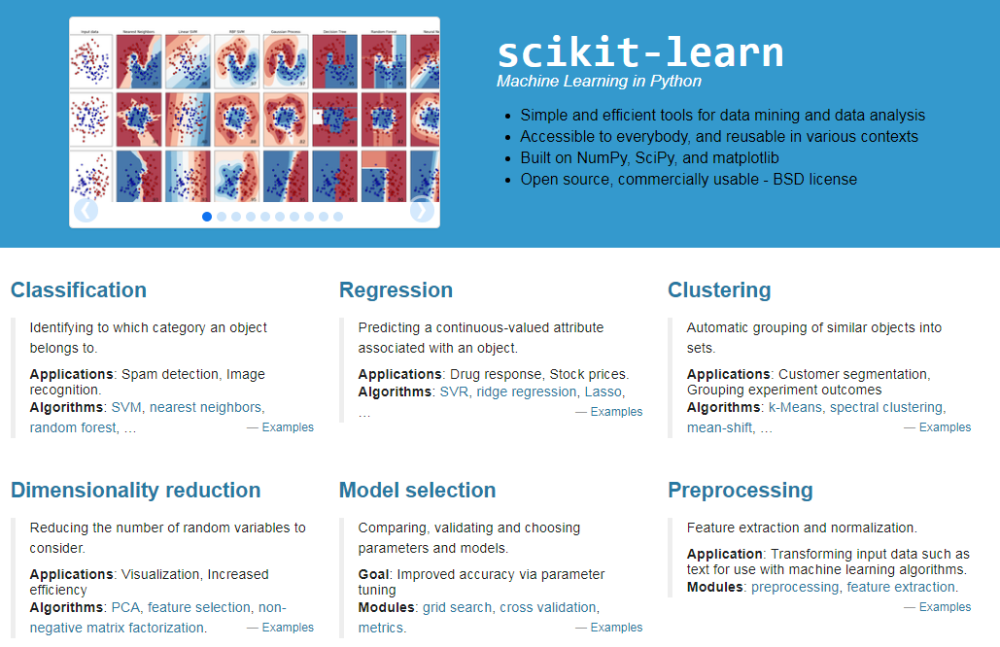

**scikit-learn**是Python实现的一个**传统机器学习**算法库，基本涵盖了机器学习涉及到的各个方面，包括数据的预处理、特征的提取、模型的构建、模型的训练、模型的验证以及模型的评价等等，目前项目已在[Github](https://github.com/scikit-learn/scikit-learn)上star数目超过2w。

scikit-learn一般简称为**sklearn**，我对sklearn开始接触已经有4年多的时间，期间好久时间没再搞过。本文仅基于以前我对sklearn的一些使用总结展开介绍，如果与最新版本有些出入，那就以后者为准。

## sklearn的安装

	pip install -U scikit-learn

sklearn依赖Python环境，需要预先安装NumPy和Scipy库，Matplotlib库也是必要的。

如果使用Windows系统，也可以从[Unofficial Windows Binaries for Python Extension Packages](http://www.lfd.uci.edu/~gohlke/pythonlibs/)上下载相应的whl文件进行安装。

## 有监督学习与无监督学习

机器学习分为**有监督学习**和**无监督学习**，介于两者之间的叫**半监督学习**。有监督学习一般包括**分类**和**回归**，对于一个classifier来说，通常需要你告诉它“这个东西被分为某某类”这样一些例子，理想情况下，一个classifier会从它得到的训练集中进行**“学习”**，从而具备对未知数据进行分类的能力。无监督学习一般包括**聚类**和**密度估计**，简单地说就是把相似的东西分到一组，聚类的时候，我们并不关心某一类是什么，而只需要把相似的东西聚到一起，因此一个聚类算法通常只需要知道如何计算相似度就可以开始工作了，cluster通常并不需要使用训练数据进行**“学习”**。

机器学习用符号则可以表示为，给定一组数据为**Z=(X,Y)**，其中X表示数据的输入或特征，Y表示数据对应的标签或类别，有监督学习相当于求解**条件概率分布P(Y|X)**，需要事先准备一些先验数据才能进行计算，而无监督学习则相当于求解**边缘概率分布P(Y)**，不需要准备先验数据。

在sklearn中，分类的使用可以如下形式：
			
	# 分类
	from sklearn.neighbors import KNeighborsClassifier
	from sklearn.naive_bayes import GaussianNB, MultinomialNB
	from sklearn.svm import LinearSVC, SVC
	from sklearn.tree import DecisionTreeClassifier
	from sklearn.ensemble import RandomForestClassifier
	clf = XXXXClassifier()
	clf.fit(X_train, y_train)
	pred = clf.predict(X_test)
	print(list(pred))

其中，clf表示我们指定的模型，fit表示模型的训练操作，predict表示将训练好的模型用于数据的预测。相应的，聚类的使用可以如下形式：

	# 聚类
	from sklearn.cluster import KMeans
	clt = KMeans(n_clusters=5)
	clt.fit(X_test)
	print(list(clt.labels_))

## 数据预处理

sklearn的数据预处理模块，可以在**sklearn.preprocessing**下找到，比较常用的是MinMaxScaler、StandardScaler、Normalizer等方法。

#### 特征降维与特征选取

特征降维与特征选取最后达到效果，都是特征维度发生了变化。但是，**特征降维**是将原始高维特征空间里的点向一个低维空间投影，新的空间维度低于原特征空间，所以维数减少了。而**特征选择**，是从n个特征中选择d(d<n)个出来，而其它的n-d个特征舍弃，所以，新的特征只是原来特征的一个子集。

**sklearn.decomposition**下提供了PCA方法，对应特征降维，**sklearn.feature_selection**下提供了一系列特征选取方法，比如说SelectKBest等。

## 评价指标

分类和聚类，根据具体情况的不同，可以衍生很多评价指标，我们还可以自定义一些评价指标。比较常用的一些概念，包括准确率、召回率、真正类率，负正类率，由它们可以分别衍生出F值、P-R曲线、ROC曲线以及AUC值等。

**sklearn.metrics**下提供了常见的评价指标，在评价模型的时候可以采取如下引用：

	from sklearn import metrics
	from sklearn.metrics import \
		confusion_matrix, \
		classification_report, \
		precision_score, \
		recall_score, \
		f1_score, \
		accuracy_score

## 关于模型参数寻优

好的模型，在于它不仅对已知数据有比较好的"预测"能力，对未知数据也有比较好的"预测"能力，也就是具备比较好的**泛化能力**。交叉验证，能够一定程度上使得模型参数空间更加稳定，在稳定的前提下，采用网格搜索方式进一步寻找到最优的参数，从而训练出最优的模型。

#### 交叉验证

交叉验证是一种模型选择方法，其思想就是将样本的一部分用于训练，另一部分用于验证，以提高模型的泛化能力。常用的交叉验证方法包括**简单交叉验证**、**k-折交叉验证**等，经常遇到的**留一法**就是k-折交叉验证的特例。

**sklearn.cross_validation**下提供了交叉验证的方法，比较常用的是train_test_split、StratifiedKFold、KFold等。

#### 网格搜索

模型参数往往是高维空间中的向量或矩阵。在sklearn中可以通过指定损失函数和寻优空间，采用网格搜索方式进行寻优。

	clf = GridSearchCV(
        estimator = pipeline,
        param_grid = parameters,
        cv = StratifiedKFold(y_train, 5),
        # cv = KFold(y_train, 5),
        scoring = "accuracy", # or scorer
        n_jobs = 3
    )
	clf.fit(X_train, y_train)

其中，pipeline为指定的损失函数，可以通过**sklearn.pipeline**下提供的方法去定义，parameters为指定的寻优空间，一般为列表或者字典形式。